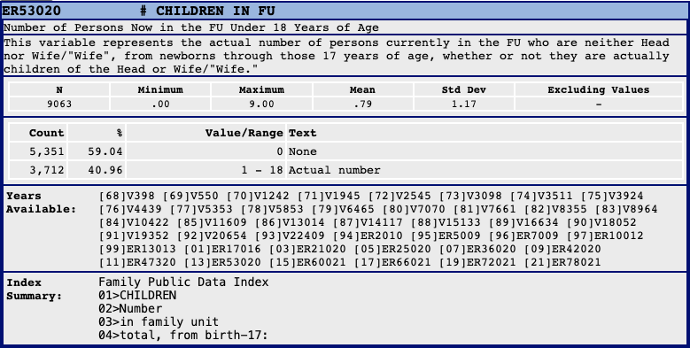

# 0. Overview

The [Panel Study of Income Dynamics](https://psidonline.isr.umich.edu/) (PSID) is the longest running longitudinal household survey in the world, which provides invaluable data covering numerous topics including marriage, income, wealth, health and etc. However, the process of converting raw PSID data files into datasets ready for analysis is quite complex and challenging, especially for new users.

This package is developed with the purpose of addressing these challenges within only R environment without additional assistance from other statistical programming softwares. By bridging these gaps, the package aims to make PSID datasets more usable and manageable for researchers and analysts.

The package is now on GitHub. To install the package, try this code in your R Console:

```{r, eval = FALSE}
devtools::install_github(repo = "Qcrates/psidread")
```

```{r}
library(DiagrammeR)
library(psidread)
```

# 1. Introduction

[**File Structure of PSID**](https://psidonline.isr.umich.edu/Guide/FileStructure.pdf): The main PSID data files include two types of data files: 1. single-year family files and 2. a cross-year individual file. The single-year family files contain data collected in each wave from 1968 through 2021, with one record for each family interviewed in the specified year. These files include family-level variables and are identified by the family Interview Number for that year. The cross-year individual file, on the other hand, contains all individual-level variables collected from 1968 to 2021 in one single file. This file includes data for both respondents and non-respondents, identified by the 1968 family Interview Number and Person Number (`ER30001` and `ER30002`). Therefore, the procedure of merging datasets from multiple waves is necessary before conducting any further analysis, if family-level variables are involved.

**Data Downloading Approach**: PSID's website offers two primary method to download the data: 1. [packaged files](https://simba.isr.umich.edu/Zips/ZipMain.aspx) and 2. [customized shopping cart](https://simba.isr.umich.edu/default.aspx) with only selected variables. These two methods have both pros and cons:

+------+---------------------------------------------------------------------------------------------------------------------+--------------------------------------------------------------------------------------------------------------+
|      | Packaged Files                                                                                                      | Customized File                                                                                              |
+======+=====================================================================================================================+==============================================================================================================+
| Pros | 1.  Reusable                                                                                                        | 1.  Take less space                                                                                          |
|      | 2.  Avoid redundant downloading                                                                                     | 2.  Options available for downloading data in the format that can be processed directly using R              |
|      | 3.  Easy to manage if you have multiple projects using PSID                                                         | 3.  Waves already merged by PSID                                                                             |
+------+---------------------------------------------------------------------------------------------------------------------+--------------------------------------------------------------------------------------------------------------+
| Cons | 1.  Hard to merge manually                                                                                          | 1.  The download procedure needs to be repeated if additional variables are added in the analysis            |
|      | 2.  Present in ASCII format and require additional software like SAS or Stata to process before being imported to R | 2.  The same variables are downloaded repeatedly if the user have multiple research projects using PSID data |
|      | 3.  Even with paid software, packaged files still need to be unzipped and converted one by one before analysis      |                                                                                                              |
+------+---------------------------------------------------------------------------------------------------------------------+--------------------------------------------------------------------------------------------------------------+

**Variable Name**: A significant challenge when analyzing PSID data is its variable name which is not so intuitive or interpretable (e.g. `ER00000`, `V000`). It can be a heavy workload for researchers working with multiple waves of data to rename these variables manually.

**Missing Waves**: In the PSID, survey questions vary across different waves, leading to some variables not being consistently available in all waves. Detailed information about the inclusion of specific questions in each wave is accessible only on the [cross-year index](https://simba.isr.umich.edu/DC/i.aspx) webpage, a method that is not user-friendly for quick reference. Manually creating a list of variables for different years is an option, but it is tedious and inconvenient.

What `psidread` package is created to help:

-   Create a table of data structure across multiple waves using the text that can be copied and pasted from the website

-   Unzip and convert the zipped files without additional help of other software

-   Read and merge the data files from multiple waves

-   Rename and reshape the dataset to fit the need for advanced analysis

# 2. Workflow of `psidread` Package

While users have the option to directly jump to a specific step in the process, I strongly advise following the procedure sequentially without skipping any steps. This approach ensures a replicable code for importing the PSID dataset. Additionally, skipping steps might lead to the failure of the complications, particularly if certain prerequisites for the code's operation are not met.

```{r, echo=FALSE, fig.width=10, fig.height=10}
DiagrammeR("
graph TB;
    A[Dataset Downloaded] --> B[psid_str, 3];
    B --> C{Type};
    C --> |Packaged| D{.rda files prepared?};
    C --> |Single| E{.rda files prepared?};
    D --> |No| F[psid_unzip, 4.1];
    D --> |Yes| G[psid_read, 5.1];
    F --> G;
    E --> |No| H[psid_unzip, 4.2];
    E --> |Yes| I[psid_read, 5.2];
    H --> I;
    G --> J[psid_reshape, 6];
    I --> J;
    J --> L((Output));
    
    style A fill:#ffffff,stroke:#4d4d4d,stroke-width:1px;
    style B fill:#ffffff,stroke:#4d4d4d,stroke-width:1px;
    style C fill:#ffffff,stroke:#4d4d4d,stroke-width:1px;
    style D fill:#ffffff,stroke:#4d4d4d,stroke-width:1px;
    style E fill:#ffffff,stroke:#4d4d4d,stroke-width:1px;
    style F fill:#ffffff,stroke:#4d4d4d,stroke-width:1px;
    style G fill:#ffffff,stroke:#4d4d4d,stroke-width:1px;
    style H fill:#ffffff,stroke:#4d4d4d,stroke-width:1px;
    style I fill:#ffffff,stroke:#4d4d4d,stroke-width:1px;
    style J fill:#ffffff,stroke:#4d4d4d,stroke-width:1px;
    style L fill:#ffffff,stroke:#4d4d4d,stroke-width:1px;
")
```

# 3. `psid_str()`: Build Your Table of Structure

## 3.1 Recommended way

This step is required no matter which type of your dataset is, because it generates an important object which will be used in the following steps: the table of data structure. The basic format of this output will be like below:

| Year | `hh_educ` | `num_child` |
|------|-----------|-------------|
| 2013 | `ER58223` | `ER53020`   |
| 2015 | `ER65459` | `ER60021`   |
| 2017 | `ER71538` | `ER66021`   |
| 2019 | `ER77599` | `ER72021`   |

You can generate this table with the below code:

```{r}
psid_str(
  varlist = c("hh_educ || [13]ER58223 [15]ER65459 [17]ER71538 [19]ER77599",
              "num_child || [13]ER53020 [15]ER60021 [17]ER66021 [19]ER72021"),
  type = "separated"
)
```

It's easy to find the `[YY]VARCODE` text from PSID website. Any codebook includes a full list of the variables in the "Years Available" part. All you need to do is to define the variable name that you want to use in your analysis code (e.g. `num_child`).



It is recommended to format the input of variable list like the above code following this syntax: `c("varname1 || [YY]VARCODE [YY]VARCODE [YY]VARCODE","varname2 || [YY]VARCODE [YY]VARCODE [YY]VARCODE")`. It is not necessary for the user to pay specific attention to the space in the text, but two mandatory requirements need to be satisfied:

1.  Put each variable in a separate string and wrap them into one vector.
2.  Separate your self-defined variable name and the variable list across years with `"||"`

Please leave the type value as its default value `"separated"`.

## 3.2 If you copy and paste your Stata code...

This way of input is inspired by `psidtools` package developed by Professor Ulrich Kohler in Stata. Therefore, this function also offers an option for users who would like to transfer their work from Stata to R. You can directly copy and paste your Stata code after `psid use` without making any changes. The only effort required here is to set the `type` argument to `"integrated"`.

For example:

```{r}
psid_varlist <- "|| religion_hh /// Household head's religious preference
	[97]ER11895 [99]ER15977 [01]ER20038 [03]ER23474 [05]ER27442 [07]ER40614 ///
	|| denom_hh /// Household head's religious denominations
	[97]ER11896 [99]ER15978 [03]ER23475 [05]ER27443 [07]ER40615 ///"
psid_str(
  varlist = psid_varlist,
  type = "integrated"
)
```

Please note that it is the user's responsibility to make sure that the year and variable code is correct. Do not include any ALL-YEAR variables (e.g. individual's sex, individual's birth order) in this function. It will be declared in the `idvars` argument in `psid_read()`.

# 4. `psid_unzip()`: Prepare Data Files

This function helps to unzip the data files downloaded from PSID website and convert them to `.rda` files, a data format that is easier to manage in R.

## 4.1 Packaged Files

Please put your packaged files in `.zip` format in one directory. Here I set the input and output directory to be the same. You can set the `exdir` to other directory so that the output `.rda` files will be exported there separately from the directory you put the original downloaded data files.

```{r}
input_directory <- system.file(package = "psidread","extdata")
output_directory <- system.file(package = "psidread","extdata")
psid_unzip(indir = input_directory,
           exdir = output_directory,
           zipped = TRUE,
           type = "package",
           filename = NA)
```

If you have already unzipped **ALL** the `.zip` data files. You can also skip the procedure by setting the `zipped` argument to be `FALSE`:

```{r}
psid_unzip(indir = input_directory,
           exdir = output_directory,
           zipped = FALSE,
           type = "package",
           filename = NA)
```

It takes some time to unzip and convert all the packaged files if your analysis involves numerous waves of data. Therefore, once this function is executed and all the `.rda` files needed to generate your dataset is ready, you do not have to run it every time before you run the `psid_read()` and `psid_reshape()` function.

## 4.2 Single Customized File

If you download the dataset from your shopping cart with selected variables, you can also use this function to unzip and convert the files. One thing to note is that you should choose the ⁠`ASCII Data With SAS Statements` when downloading. Compared to packaged files, you will need to

1.  specify the name of your data file to unzip and convert in the `filename` argument
2.  change the `type` argument to `"single"`

For example:

```{r}
psid_unzip(indir = input_directory,
           exdir = output_directory,
           zipped = TRUE,
           type = "single",
           filename = "J327825.zip")
```

The user can also use `psid_unzip()` in this way to unzip and convert specific packaged data files, especially when they are adding one wave to their dataset but do not want to go through the whole directory again.

# 5. `psid_read()`: Read Data

Please make sure you have had the below checklist done before you run the `psid_read()` function:

-   [ ] Run the `psid_str()` function and get the table of data structure stored in the global environment.

-   [ ] Run the `psid_unzip()` function and have all the data files prepared in `.rda` format.

-   [ ] Have the cross-year individual packaged file (if you are packaged file user) downloaded, or have at least one individual-level variable downloaded in your customized dataset (if you are the customized file user). Even if you do not use individual-level variables, please do this. This package will collapse your dataset to household-level if you need in `psid_reshape()`.

All the item above checked? Let's move on to this core step!

## 5.1 Packaged Files

The advantage of this package is outstanding especially for data processing over multiple packaged dataset. One example:

```{r}
psid_varlist = c(" hh_age || [13]ER53017 [17]ER66017", " p_age || [13]ER34204")
str_df <- psid_str(varlist = psid_varlist, type = "separated")
input_directory <- system.file(package = "psidread","extdata")
psid_df <- psid_read(indir = input_directory, str_df = str_df,idvars = c("ER30000"),type = "package",filename = NA)
str(psid_df)
```

## 5.2 Single Customized File

If you are reading all the variables from one single file, the only different things you need to change here are:

1.  Specify the name of the data file
2.  Change your `type` argument to `"single"`

```{r}
psid_df <- psid_read(indir = input_directory, str_df = str_df,idvars = c("ER30000"),type = "single",filename = "J327825")
str(psid_df)
```

## 5.3 Notes

Please note that the `indir` argument in this function should be the directory where you store the `.rda` files. Therefore, it should be the `exdir` in `psid_unzip()` if you use this function to prepare data.

The user may notice that some additional variables, which are not declared in your table of data structure, are also added to the data frame:

1.  Sequence number for each year (e.g. ER34202 for 2013 and ER34502 for 2017)
2.  Relation to household head (e.g. ER34203 for 2013 and ER34503 for 2017)
3.  Interview number (e.g. ER34201 for 2013 and ER34501 for 2017)
4.  `pid`: The individual-level identification key, equals to **`ER30001 * 1000 + ER30002`**

They are survey information variables. Please do not drop them before you run the `psid_reshape()`. I will strongly recommend you to keep them in the final output because they can be very useful in the analysis.

# 6. `psid_reshape()`: Format Data

We finally come to the last step! `psid_reshape()` function will rename and reshape the data to the final output ready for your next-step analysis!

All the variables will be renamed following your self-defined variable name in `psid_str()`. You can also reshape the dataset to a long version if you want to further process the data of multiple waves together. For example:

```{r}
df <- psid_reshape(psid_df = psid_df, str_df = str_df, shape = "long", level = "individual")
df
```

If you would like to keep the wide shape of the data frame. The variable name will be `varname_YYYY`. For example,

```{r}
df <- psid_reshape(psid_df = psid_df, str_df = str_df, shape = "wide", level = "individual")
df
```

You can also collapse the data to household level in this step. Only one record will be kept here for each household at each wave:

```{r}
df <- psid_reshape(psid_df = psid_df, str_df = str_df, shape = "long", level = "household")
df
```

Feel free to reshape the data based on your own needs!
